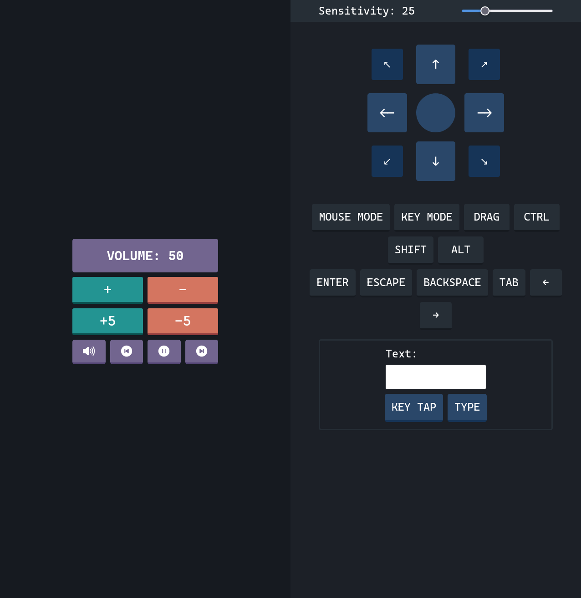

# Remote PC

This is a nodejs + svelte based application to control your computer from another
device. This is intended only for simple media, mouse and keyboard control.
You must also be on the same network as the host. Overall a wireless mouse and keyboard
would be way better.

You might be interested in [rustdesk](https://github.com/rustdesk/rustdesk) which
is more advanced and allows for connections between different networks.

## Features

<!-- prettier-ignore -->
- Pause/Play
- Mute
- Volume up & Down
- Move mouse
- Press keys
- Mouse Mode (your mouse movements are mirrored on the host pc)
- Key Mode (your keys are mirrored on the host pc)

## Preview



## Installation

Might need some [requirements for robotjs](https://github.com/octalmage/robotjs/#building)

Compile it yourself for now:

```bash
git clone https://github.com/karizma/remote-pc.git
cd remote-pc
pnpm i
npm link
```

then just run it with `remote-pc`

If you need help, create an issue.

## Usage

If you plan to only use a mobile device without a physical keyboard (phones, tablets, etc..),
then the UI is pretty self explainatory, and you can stop reading this section.

When you load the website, you are in normal mode, there are three other modes you
can join: mouse mode, reverse mouse mode, and key mode.

Mouse mode is to help move the move easier, although it only works on pcs/laptops
since mobile devices don't have a mouse/trackpad. You can enter/exit mouse mode
by either using `ctrl+m` or by pressing the label that says 'mouse mode'.

While in mouse mode, when you move your mouse, the host pc's mouse also moves.
If your viewport is small, you will find that often times you will reach the max height
or max width and still need to travel further. You can turn off mouse mode (`ctrl+m`),
reposition your mouse and then start again. But this is pretty tedious, so instead
you can enter reverse mouse mode, by pressing `r`, and now as your mouse moves
left, the host pc's mouse moves right. When in reverse mouse mode the label for
'mouse mode' will be red instead of blue.

Key mode is to help press keys on the pc easier, when you press a key on your
laptop/pc it'll mirror it to the host pc. Obviously doesn't work on mobile devices either.
Some key combinations might not work like `ctrl+m`, `ctrl+c` since this program use it
and other combinations like `ctrl+w` will not work since browsers don't send it to the
keyboard event, and instead just close.

I guess you could use a bluetooth keyboard or mouse on your mobile device, but
you might aswell just connect it to the host pc instead.

### Keyboard Shortcuts

<!-- prettier-ignore -->
- `ctrl+k` toggle key mode
- `ctrl+m` toggle mouse mode
  - `r` toggle reverse mouse mode 
- `ctrl+c` click regardless of mode
- when key mode is off
  - `c` to click 
  - `m` mute volume
  - `+` or `=` increase audio
  - `-` decrease audio
  - `<Space>` audio pause
  - `<Escape>` press escape on host pc

## Configuration

TODO
